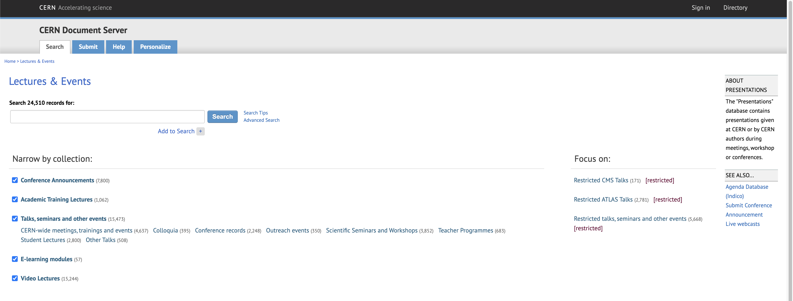
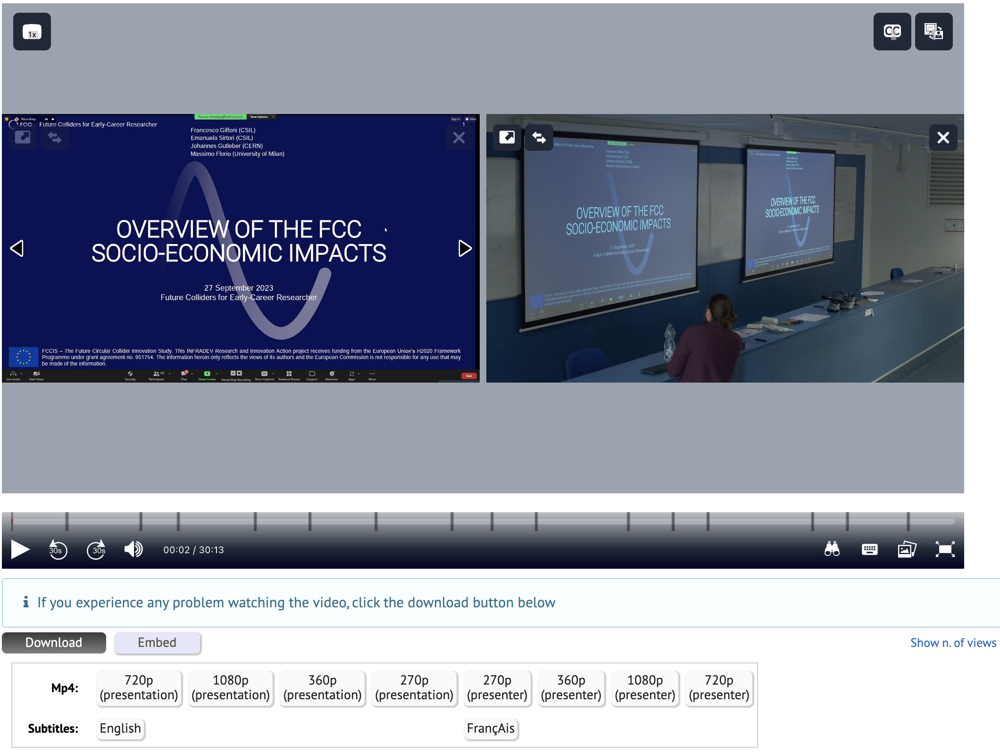
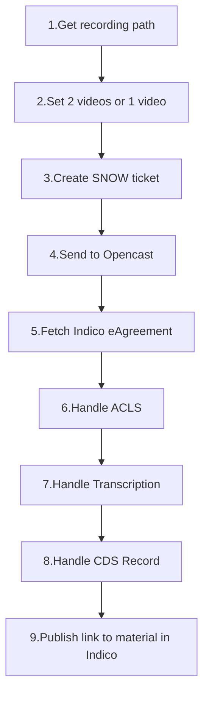
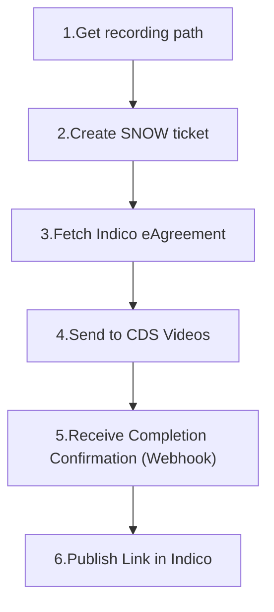
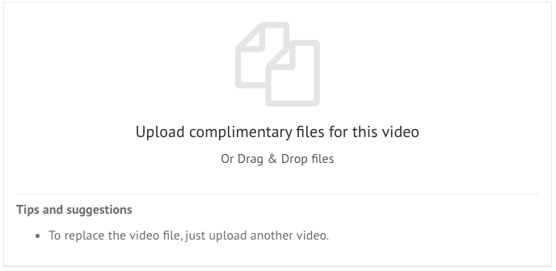
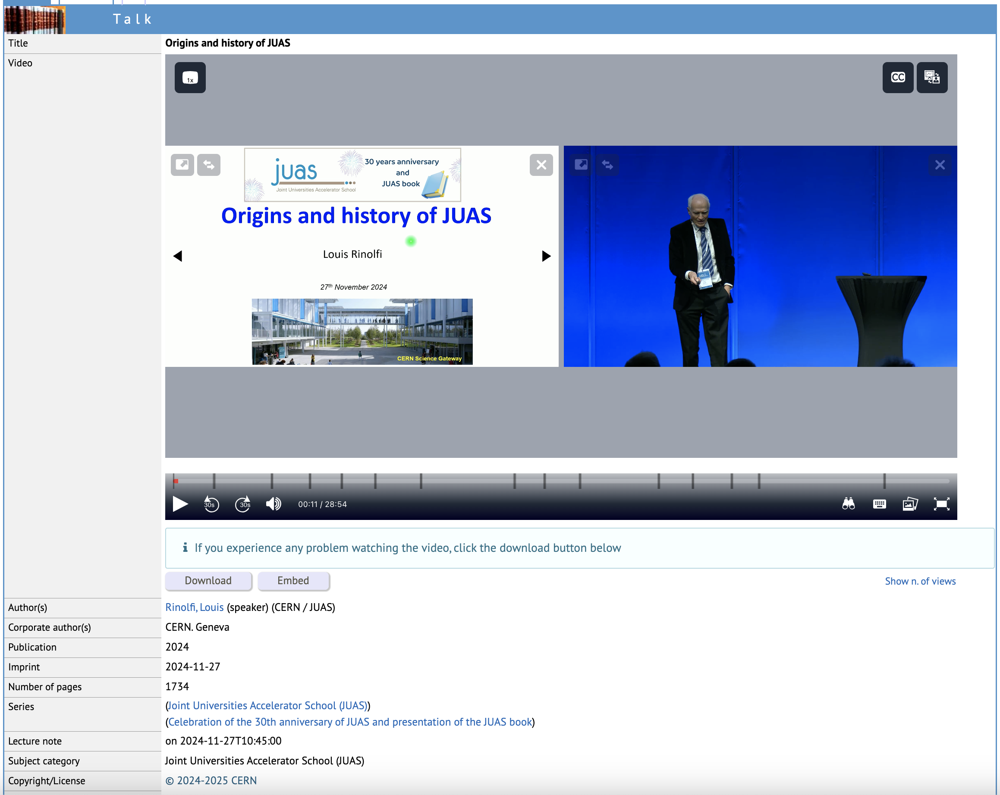
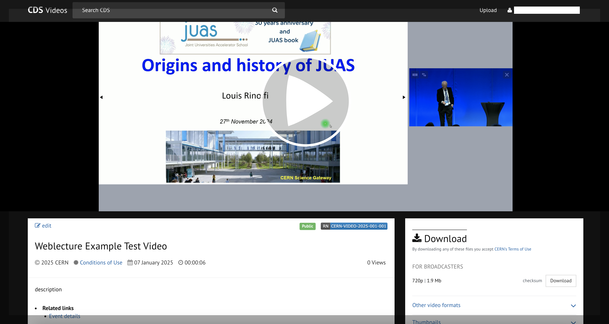

- Start Date: 2024-11-20
- RFC PR: [#1997](https://github.com/CERNDocumentServer/cds-videos/pull/1997)
- Authors: Zacharias Zacharodimos, Zubeyde Civelek, Javier Romero Castro

# Web Lectures Migration

## Summary

This RFC proposes the migration of the existing collection of **Weblectures**, which contains video recordings of academic content such as lectures, conferences, talks, and seminars, from LectureMedia servers (where they are currently hosted and embedded in CDS) to the CDS Videos platform. By migrating to CDS Videos, the platform will achieve full ownership and management of video hosting, providing an improved user experience with a modern interface and consistent video performance.


## Motivation

The migration is motivated by the goal of collecting all videos into one platform, upgrading the current CDS Videos system to support the migration of weblectures, and improving user experience. Currently, weblectures are hosted on LectureMedia servers, which present certain limitations. This task will collect all video content into a single platform, improve video management, and provide a more consistent and better user experience.

- As an administrator, I want the ability to manage all video content directly within CDS Videos.
- As a repository manager, I want to own the storage to implement access control and ensure data safety.
- As a user, I want a consistent and user-friendly experience when accessing video content, enabling me to easily find, view, and interact with all available videos.

## Detailed design
    
### CDS Weblectures Structure

Weblectures is a collection that contains video recordings of academic content, such as lectures, conferences, talks, and seminars. The collection is visually organized into sub-collections, as shown below: 
    


A typical weblecture record consists of two primary video files: the **Presenter Video** and the **Presentation Video**. The Presenter Video captures the speaker or lecturer, while the Presentation Video records or displays the slides, visuals, or supplementary materials shared during the session. These two videos are displayed synchronously within a single video player, presenting the speaker and their content side-by-side. Each video file is also available in multiple subformats, which can be downloaded to accommodate users. Also weblectures are connected to an Indico event. After the weblecture record is handled in CDS, a link to the material is manually published in Indico.



The current player in CDS is using Paella player provided via embedding by the WebCast team. This player uses a data.json file to reproduce the video. Here an example of [this file](https://lecturemedia.cern.ch/2009/65921c2/data.v2.json)
<details>

```json
{
    "metadata": {
        "duration": "15",
        "title": "Exploring Lambda B Spin Effects through Toy Monte Carlo and Event Displays",
        "preview": "/2009/65921c2/real/slides/20090813140714.png"
    },
    "streams": [
        {
            "sources": {
                "mp4": [
                    {
                        "src": "/2009/65921c2/65921c2-podcast.mp4",
                        "mimetype": "video/mp4",
                        "baudrate": "1200000",
                        "res": {
                            "w": "640",
                            "h": "360"
                        }
                    },
                    {
                        "src": "/2009/65921c2/65921c2-mobile.mp4",
                        "mimetype": "video/mp4",
                        "baudrate": "300000",
                        "res": {
                            "w": "640",
                            "h": "360"
                        }
                    }
                ]
            },
            "preview": "/2009/65921c2/real/slides/20090813140714.png",
            "content": "presenter"
        }
    ],
    "frameList": [
        {
            "id": "frame_20090813140714",
            "mimetype": "image/png",
            "time": 0,
            "url": "/2009/65921c2/real/slides/20090813140714.png",
            "thumb": "/2009/65921c2/thumbs/slides/20090813140714.png"
        },
        {
            "id": "frame_20090813140747",
            "mimetype": "image/png",
            "time": 33,
            "url": "/2009/65921c2/real/slides/20090813140747.png",
            "thumb": "/2009/65921c2/thumbs/slides/20090813140747.png"
        },
        {
            "id": "frame_20090813140841",
            "mimetype": "image/png",
            "time": 87,
            "url": "/2009/65921c2/real/slides/20090813140841.png",
            "thumb": "/2009/65921c2/thumbs/slides/20090813140841.png"
        },
        {
            "id": "frame_20090813140946",
            "mimetype": "image/png",
            "time": 152,
            "url": "/2009/65921c2/real/slides/20090813140946.png",
            "thumb": "/2009/65921c2/thumbs/slides/20090813140946.png"
        },
        {
            "id": "frame_20090813141017",
            "mimetype": "image/png",
            "time": 183,
            "url": "/2009/65921c2/real/slides/20090813141017.png",
            "thumb": "/2009/65921c2/thumbs/slides/20090813141017.png"
        },
        {
            "id": "frame_20090813141023",
            "mimetype": "image/png",
            "time": 189,
            "url": "/2009/65921c2/real/slides/20090813141023.png",
            "thumb": "/2009/65921c2/thumbs/slides/20090813141023.png"
        },
        {
            "id": "frame_20090813141101",
            "mimetype": "image/png",
            "time": 227,
            "url": "/2009/65921c2/real/slides/20090813141101.png",
            "thumb": "/2009/65921c2/thumbs/slides/20090813141101.png"
        },
        {
            "id": "frame_20090813141208",
            "mimetype": "image/png",
            "time": 294,
            "url": "/2009/65921c2/real/slides/20090813141208.png",
            "thumb": "/2009/65921c2/thumbs/slides/20090813141208.png"
        },
        {
            "id": "frame_20090813141218",
            "mimetype": "image/png",
            "time": 304,
            "url": "/2009/65921c2/real/slides/20090813141218.png",
            "thumb": "/2009/65921c2/thumbs/slides/20090813141218.png"
        },
        {
            "id": "frame_20090813141248",
            "mimetype": "image/png",
            "time": 334,
            "url": "/2009/65921c2/real/slides/20090813141248.png",
            "thumb": "/2009/65921c2/thumbs/slides/20090813141248.png"
        },
        {
            "id": "frame_20090813141300",
            "mimetype": "image/png",
            "time": 346,
            "url": "/2009/65921c2/real/slides/20090813141300.png",
            "thumb": "/2009/65921c2/thumbs/slides/20090813141300.png"
        },
        {
            "id": "frame_20090813141405",
            "mimetype": "image/png",
            "time": 411,
            "url": "/2009/65921c2/real/slides/20090813141405.png",
            "thumb": "/2009/65921c2/thumbs/slides/20090813141405.png"
        },
        {
            "id": "frame_20090813141431",
            "mimetype": "image/png",
            "time": 437,
            "url": "/2009/65921c2/real/slides/20090813141431.png",
            "thumb": "/2009/65921c2/thumbs/slides/20090813141431.png"
        },
        {
            "id": "frame_20090813141520",
            "mimetype": "image/png",
            "time": 486,
            "url": "/2009/65921c2/real/slides/20090813141520.png",
            "thumb": "/2009/65921c2/thumbs/slides/20090813141520.png"
        },
        {
            "id": "frame_20090813141549",
            "mimetype": "image/png",
            "time": 515,
            "url": "/2009/65921c2/real/slides/20090813141549.png",
            "thumb": "/2009/65921c2/thumbs/slides/20090813141549.png"
        },
        {
            "id": "frame_20090813141623",
            "mimetype": "image/png",
            "time": 549,
            "url": "/2009/65921c2/real/slides/20090813141623.png",
            "thumb": "/2009/65921c2/thumbs/slides/20090813141623.png"
        },
        {
            "id": "frame_20090813141716",
            "mimetype": "image/png",
            "time": 602,
            "url": "/2009/65921c2/real/slides/20090813141716.png",
            "thumb": "/2009/65921c2/thumbs/slides/20090813141716.png"
        },
        {
            "id": "frame_20090813141845",
            "mimetype": "image/png",
            "time": 691,
            "url": "/2009/65921c2/real/slides/20090813141845.png",
            "thumb": "/2009/65921c2/thumbs/slides/20090813141845.png"
        },
        {
            "id": "frame_20090813141922",
            "mimetype": "image/png",
            "time": 728,
            "url": "/2009/65921c2/real/slides/20090813141922.png",
            "thumb": "/2009/65921c2/thumbs/slides/20090813141922.png"
        },
        {
            "id": "frame_20090813141951",
            "mimetype": "image/png",
            "time": 757,
            "url": "/2009/65921c2/real/slides/20090813141951.png",
            "thumb": "/2009/65921c2/thumbs/slides/20090813141951.png"
        },
        {
            "id": "frame_20090813142017",
            "mimetype": "image/png",
            "time": 783,
            "url": "/2009/65921c2/real/slides/20090813142017.png",
            "thumb": "/2009/65921c2/thumbs/slides/20090813142017.png"
        },
        {
            "id": "frame_20090813142044",
            "mimetype": "image/png",
            "time": 810,
            "url": "/2009/65921c2/real/slides/20090813142044.png",
            "thumb": "/2009/65921c2/thumbs/slides/20090813142044.png"
        },
        {
            "id": "frame_20090813142045",
            "mimetype": "image/png",
            "time": 811,
            "url": "/2009/65921c2/real/slides/20090813142045.png",
            "thumb": "/2009/65921c2/thumbs/slides/20090813142045.png"
        },
        {
            "id": "frame_20090813142136",
            "mimetype": "image/png",
            "time": 862,
            "url": "/2009/65921c2/real/slides/20090813142136.png",
            "thumb": "/2009/65921c2/thumbs/slides/20090813142136.png"
        },
        {
            "id": "frame_20090813142229",
            "mimetype": "image/png",
            "time": 915,
            "url": "/2009/65921c2/real/slides/20090813142229.png",
            "thumb": "/2009/65921c2/thumbs/slides/20090813142229.png"
        }
    ],
    "captions": [
        {
            "format": "vtt",
            "lang": "en",
            "text": "English",
            "url": "/2009/65921c2/65921c2_en.vtt"
        },
        {
            "format": "vtt",
            "lang": "fr",
            "text": "Français",
            "url": "/2009/65921c2/65921c2_fr.vtt"
        }
    ]
}
```
</details>
    
#### CDS Legacy Weblecture Publishing Workflow  
    

    
1. Begin the process by getting the path to the recorded video files.
2. Decide between 2 videos or 1 video and cut the video(s) by setting the start and end times.
3. Create a snow ticket to be used by the 2nd level to track their work and sometimes to communicate with the event owner.
4. Send the video files to Opencast for generating subformats.
5. Retrieve the speaker consent information (accepted or rejected) from Indico. Only  accepted consent will proceed to the next steps.
6. Handle access control lists (ACLs) fetched from Indico to ensure appropriate permissions for viewing the videos.    
7. Process transcription for accessibility.
8. Create or update the weblecture record in CDS, including metadata, access settings, and the presenter/presentation video files.    
9. After verifying the completed record, manually publish the link to the weblecture material in Indico to make it accessible to users.

    
### New proposed CDS Videos Workflow
    
    

    
1. Begin the process by getting the path to the recorded video files.
2. Create a SNOW ticket to track progress and communication as in the CDS Weblecture Workflow.
3. Fetch the Indico eAgreement to validate speaker consent and access permissions as in the CDS Weblecture Workflow.

4. **Send to CDS Videos:**
    - Instead of displaying two videos synchronously within a single video player, presenter and presentation side-by-side as in the current CDS Weblectures, CDS Videos will display them using a picture-in-picture (composite) format.
    - The prepared video files and metadata are submitted to CDS Videos.
    - The Access Control List (ACL) is set by the Record service team as part of the project/video metadata.
    - Subformat generation (via Opencast), translation (a new approach to be implemented, this should be differentiated from the user uploaded translations), video frame extraction are automatically managed by CDS Videos.
    
5. **Receive Completion Confirmation (Webhook):**
    - Once CDS Videos has completed processing, the webcaste team needs to be notified, on solution could be; by pulling via a webhook that notifies the system. (This is a new approach; instead of checking the status, the system will receive a push notification indicating that processing is complete.)
    - Interesting resource shared by Nico: https://github.com/standard-webhooks/standard-webhooks/blob/main/spec/standard-webhooks.md

6. After verifying that the videos meet all standards, publish the link to the video material material in Indico to make it accessible to users.
    
### Workflow to upload and publish a video to CDS Videos through the REST API

This section includes the step-by-step process for uploading and publishing videos to the CDS Videos platform using the REST API. By leveraging this workflow, webcast team can efficiently manage weblecture video projects, define metadata, and ensure proper publication. The streamlined process integrates metadata creation, file uploads, and publication steps, ensuring consistency and ease of use for administrators and repository managers.    
    
| **Method**                                  | **Step**                                  |
| ------------------------------------------- | ----------------------------------------- |
| <span style="color:purple">**POST** </span> | Step 1 - Create a project                 |
| <span style="color:purple">**POST** </span> | Step 2 - Create a video                   |
| <span style="color:orange">**PUT** </span>  | Step 3 - Upload the video                 |
| <span style="color:purple">**POST** </span> | Step 4 - Create a flow                    |
| <span style="color:orange">**PUT** </span>  | Step 5 - Upload additional file (*optional*)          |
| <span style="color:orange">**PUT** </span>  | Optional: Update the Access of the Video                 |
| <span style="color:green">**GET** </span>   | Step 6 - Get project to check the flow is finished |
| <span style="color:purple">**POST** </span> | Step 7 - Publish                          |   

A detailed guide, using Bruno - a REST API testing tool - is available [here](https://github.com/CERNDocumentServer/cds-videos?tab=readme-ov-file#publish-video-through-rest-api).

- **Step 1:** Create a project using the `POST` method to define metadata, such as the category, type, and access permissions.
- **Step 2:** Create a video within the project to define metadata for the video, including the title, contributors, date, language, and access permissions.
- **Step 3:** Upload the video file using a `PUT` request.
- **Step 4:** Create a flow for tasks such as subformat generation (Opencast), metadata extraction, and video frame extraction.
- **Step 5 (Optional):** Upload additional files associated with the video. 
    - Note: The current version of CDS Videos does not support uploading an additional video file through the UI.
- **Optional: Update the Access of the Video:** Modify access permissions for the video if required.
- **Step 6:** Verify that the flow tasks (e.g., subformat generation) are complete.
- **Step 7:** Publish the video using a `POST` request.

    
### Mapping CDS MarcXML Metadata Fields to CDS Videos Model

To ensure a seamless migration of metadata from the legacy CDS Weblectures to the CDS Videos platform, a complete mapping of MarcXML fields to the CDS Videos data model is required. This mapping tries to ensure that all relevant metadata fields are accurately translated and preserved in the new system while maintaining data integrity and usability.
    
The table below provides a summary of [this  document](0001/Analysis-to-map-MarcXML-fields-to-CDSVideos.md); an analysis between MarcXML fields and the CDS Videos data model, highlighting required fields, optional fields, and any new fields that may need to be introduced for a complete migration.

| Name                                              | MarcXML Tag/Code        | Videos Data Model                   | Required  | Notes                                                                                        |
| ------------------------------------------------- | ----------------------- | ----------------------------------- | --------- | -------------------------------------------------------------------------------------------- |
| Description                                       | 520__a                  | description                         | Yes       | Use the title if the record doesn't have a description.                                      |
| Contributor                                       | 700__a, 700_e, 700__u   | contributor name, role, affiliation | Yes       | Contributor: Role will be optional, new field will be added for affiliation.                 |
| Copyright/ License                                | 540__/ 542__f           | license                             | No        | `URL` field will be added to the License, `statement` field will be added to the Copyright.  |
| Note                                              | 500__a                  | Not exist                           | Not exist | Will be added as a hidden field `internal_note`.                                             |
| Indico                                            | 8564_u/y, 111__g 970__a | related_links                       | No        | Indico link will be added as `Related Links` and indico id added as alternative identifiers. |
| Conference: Presented at, Published in            | 962__b, 773__           | Not exist                           | Not exist | New fields for conference information.                                                       |
| Related document                                  | 7870_                   | Not exist                           | Not exist | Will be `related works` as it’s done in CDS-RDM.                                             |
| Accelerator, Facility, Experiment, Project, Study | 693__                   | Not exist                           | Not exist | Will be added as `custom fields`.                                                            |
| Extra Title and Description                       | 246__a, 590__a          | Not exist                           | Not exist | Will be added as `additional title/description` as done in RDM.                              |
| Video Location                                    | 518__r, 111__c          | Not exist                           | Not exist | Location will be added as a new field.                                                       |

#### Considerations for Field Mapping

Any MarcXML fields without a direct match in the CDS Videos model, including those not displayed in CDS but hold value for archival, curation, or internal processes, will be addressed by adding them as new or custom fields, storing them as supplemental metadata, or transforming them into structured internal metadata (e.g., `_curation`  fields) or integrating them into existing fields where applicable.
    
#### Key Tasks for Mapping MarcXML Fields to CDS Videos Model
      
- **New Fields**
    - **Alternative Identifiers**: Add fields for `Report Number`, `Indico Event ID`, and `System Control Number`.
    - **Internal Note**: Introduce a hidden field for notes.
    - **Conference Info**: Add fields for `Presented at` and `Published in`.
    - **Custom Fields**: Include `Accelerator/Facility, Experiment, Project, Study`.
    - **Related Works**: Replace "Related Links" with a new field, no migration needed initially.
    - **Additional Metadata**: Add fields for `French Description`, `Related Title`, and Indico event location.
    - **Curation Fields**: Integrate fields for `Location`, `Physical Medium`, `Document Type`, and related internal notes.

- **Existing Fields**
    - **Contributors**: Update role to optional, add `Affiliation`, and introduce roles such as Performer, Participant, and Research Group.
    - **Copyright/License**: Align with RDM standards; add URL to licenses and a copyright statement.

#### Sample Mapping Example
Here’s an example of how a weblecture MarcXML record maps to a CDS Videos entry:

- **MarcXML:**
    ```xml=
    <datafield tag="245" ind1=" " ind2=" ">
        <subfield code="a">Title of the video</subfield>
    </datafield>
    <datafield tag="700" ind1="1" ind2=" ">
        <subfield code="a">Name, Surname</subfield>
    </datafield>
    <datafield tag="041" ind1=" " ind2=" ">
        <subfield code="a">eng</subfield>
    </datafield>
    <datafield tag="520" ind1=" " ind2=" ">
        <subfield code="a">Video's description</subfield>
    </datafield>
    <datafield tag="518" ind1=" " ind2=" ">
        <subfield code="d">2024-11-19T14:00:00</subfield>
    </datafield>
    ```
- **CDS Videos Data Model:**
    ```json
    {
        "metadata": {
            "contributors": [
                {
                "name": "Name, Surname",
                "role": "Speaker"
                }
            ],
            "language": "en",
            "date": "2024-11-19",
            "description": "Video's description",
            "title": {
                "title": "Title of the video"
            },
        }
    
    }
    ```

    
### Files Upload    

Files are currently localted in CEPH. In order to migrate them we will be able to mount the volume on our machines and consume the files. With the `master_path` (`/mnt/master_share/master_data/2024/<indico_contribution_id>`) we have access to the original videos (camera and slides), and we can construct the path where all the subformats and composite video is stored (`/mnt/media_share/media_data/2024/<indico_contribution_id>`). Camera and slides files will be kept as additional files for old and new records. 
    
#### Uploading video files as additional files from UI
    
Currently when video files are uploaded as a complimentary file, the first video file replaces the main video and starts the flow(metadata extraction, frame extraction, and transcoding). The UI does not support uploading video files as additional files. We need to change this to support uploading presenter and presentation of weblectures as additional files.



To support weblectures effectively, this behavior needs to be updated to allow uploading presenter and presentation videos as additional files.

**Required Behavior:**
1. **Replacing the Main File:**  
   Users should be able to replace the existing main video file, which will trigger the workflow for processing the new main file (e.g., metadata extraction and transcoding).
   
2. **Uploading Additional Files:**  
   Users should be able to upload supplementary video files (e.g., presenter and presentation videos for weblectures) as additional files without triggering the workflow for these files.

**Proposed Changes:**
- Use the tagging mechanism from ObjectVersions to distinguish additional files from the main file.
- Modify the file upload logic to separate handling of main and additional files.
- Provide distinct interfaces or clear options for replacing the main file and uploading additional files.
    
### Redirections

In CDS the ids are integers, there is a risk of collision, therefore we should mint a legacy recid as done for cds-rdm.

### Statistics

The migration of all record's statistics from the current CDS system need to be moved on the CDS Videos Opensearch cluster.

### Subcollections

The current structure includes several collections and subcollections:
- Academic Training Lectures 
- Talks, seminars and other events 
    - CERN-wide meetings, trainings and events
    - Colloquia
    - Conference records
    - Outreach events
    - Scientific Seminars and Workshops
    - Teacher Programmes
    - Student Lectures
    - Other Talks
- E-learning modules
- Video Lectures
- Restricted CMS Talks 
- Restricted ATLAS Talks
- Restricted talks, seminars and other events 
    
The **CDS-Videos** project category will be `CERN`, which already exists category, while the type will be `Lectures`. This type will be restricted to ensure appropriate access control. 

Although the exact structure of the collection tree has not been finalized, it was decided that a new `collections` array field will be introduced. This field will allow the creation of the tree structure, and it'll be similar to the one used for `Press`.

**Subject Category (tag 650)** and **Series (tag 490)** can potentially be used as keywords. Final decision needs further discussion.

Detailed document can be found [here](0001/Analysis-to-map-MarcXML-fields-to-CDSVideos.md#categorytype-keywords).
    
### Access Control for Viewing Weblecture Records on CDS Videos

Weblecture records are also linked in Indico events, where users beyond the CERN community (e.g., those with Indico accounts) can access the content. However, the current CDS Videos restricts login and upload functionality to primary CERN accounts. To support a wider audience while maintaining upload restrictions, the following changes are proposed:

#### Key Changes:
1. **Separate Permissions for Uploading and Viewing:**  
   - Allow non-primary CERN users to log in and view content, including restricted videos, based on access controls.
   - Restrict video upload functionality to primary CERN accounts only.

2. **Enable Indico Account Access for Restricted Videos:**  
   - Modify the login system in CDS Videos to allow non-primary CERN accounts to access restricted videos if they have the necessary permissions.

#### Benefits:
- Facilitates wider dissemination of content by enabling access for non-primary CERN account holders.
- Maintains control over video uploads by limiting this functionality to CERN users.
- Aligns CDS Videos with the existing accessibility of Indico events.

By implementing these changes, CDS Videos can better support the sharing of weblectures with both CERN and non-CERN audiences, ensuring a more inclusive and user-friendly experience.

## Example

To illustrate the implications of this RFC, here are concrete examples of a current CDS Weblecture record and a CDS Videos Weblecture record (in its current version):

The following example demonstrates how a typical weblecture record is structured in the current CDS platform:



*Figure 1: Current CDS Weblecture record showcasing the Presenter Video and Presentation Video displayed side-by-side.*

---

Below is an example of how a similar record is currently represented in the current version of CDS Videos:


    
*Figure 2: Current CDS Videos record displaying a picture in picture video file.*

---

In CDS, presenter and presentation video are displayed synchronously to provide a side-by-side view of the speaker and their content. In the proposed CDS Videos platform, the videos will be displayed as a composite video combining the presenter and the presentation, improving video management and user experience. 

By migrating the weblecture content, CDS Videos will achieve full ownership and management of video hosting while collecting all videos into a single platform.


## Unresolved questions
    
### Record Ownership

To be discussed how we will manage updates once the video is published. The metadata can be edited in indico, who and how should the metadata of the video be updated?

Is still not clear who will have the rights to edit the record on CDS. There are some concerns shared from the webcast team that the person that accepted the e-agreement on Indico, if they have edit rights they might be able to replace the video, when they shouldn't as they gave their permission already.

### Webcast team meeting questions
    
- Ruben: On that behalf and to clarify the differences among both solutions I have created a [comparative table](https://codimd.web.cern.ch/aOFdr8RDSqibUSKmbdOOFw?view). I would reduce those differences so the user community is less impacted. As we commented in first meeting it would be easy to do a survey, specially now that we are producing the new composite videos. 
- Indico events can have hundreds of weblecture videos, how can we group them? 
    - One possible solution is the "Projects" but this has the limitation of 10 videos
    - If we use the indico event in `related_links` all of them has the same event link, can we group them using the `related_links`?
    
### Existing Weblectures

- [ ] Analyze the HTTP logs to see who is using the Web Lectures and embedding them elsewhere, e.g. <https://academictraining.cern.ch/>, but there could be more. This site is harvesting CDS to get the newly published lectures. If breaking changes are required, get in contact with them and define a timeline.

- [ ] Fix the links to Indico. See https://cds.cern.ch/record/1565119 the links at the bottom Talk/Event details. These are old style URLs. Right url for event: https://indico.cern.ch/event/418151/  talk: we need to ask the Indico guys
    
### New Weblectures

#### Access Control for Uploads:

- Define who is authorized to upload weblectures to the platform and subsequently edit them.


## Resources/Timeline

> Which resources do you have available to implement this RFC and what is the overall timeline?

